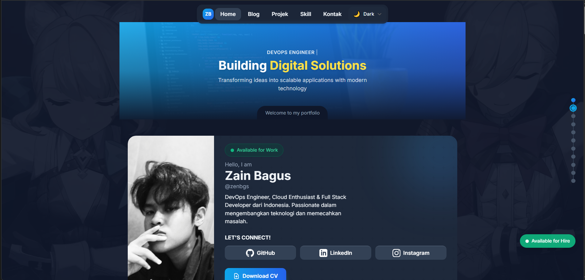

<div align="center">

# zenbgs.github.io

Personal portfolio website showcasing my journey as a DevOps Engineer & Full Stack Developer.

[](https://zenbgs.github.io)
[](https://astro.build)



</div>

---

## Features

- **Responsive Design** - Optimized for all screen sizes
- **Dark/Light Mode** - Toggle between themes
- **Interactive Components** - Skill charts, animated counters, and more
- **Blog Section** - Technical articles and tutorials
- **Project Showcase** - Highlighted works and case studies
- **Performance Optimized** - Fast loading and smooth experience

---

## Tech Stack

| Category | Technologies |
|----------|-------------|
| **Framework** | Astro |
| **Styling** | Tailwind CSS |
| **Deployment** | GitHub Pages |
| **Icons** | Heroicons, Devicons |

---

## Project Structure

```
├── src/
│   ├── components/    # Reusable UI components
│   ├── layouts/       # Page layouts
│   ├── pages/         # Route pages
│   └── styles/        # Global styles
├── public/
│   ├── images/        # Static images
│   └── cv/            # Resume PDF
└── dist/              # Build output
```

---

## Quick Start

```bash
# Clone repository
git clone https://github.com/zenbgs/zenbgs.github.io.git

# Navigate to project
cd zenbgs.github.io

# Open in browser
# Just open index.html or use a local server
```

---

## Contact

<div align="center">

[](https://zenbgs.github.io)
[](https://github.com/zenbgs)
[](https://linkedin.com/in/zenbgs)
[](mailto:zenbgsv@gmail.com)

</div>

---

<div align="center">

Made with passion by **Zain Bagus**

</div>